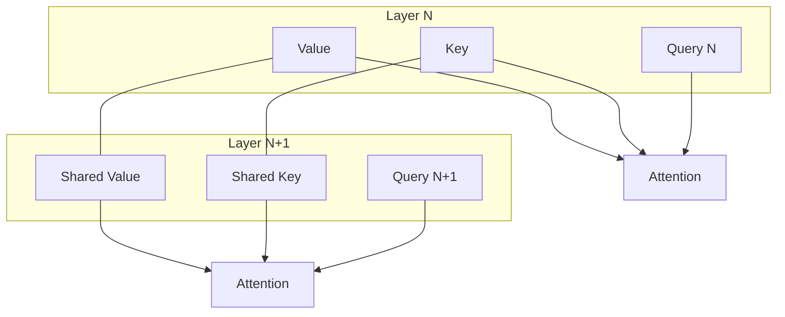

# Cross-Layer Attention (CLA)

## 📋 Overview
Cross-Layer Attention (CLA) is an architectural optimization for Transformers that reduces the KV cache size by sharing Key and Value representations across multiple decoder layers.

## 🏗️ Architecture Diagram

## 🔍 Key Details
- **First Used:** 2024
- **Primary Benefit:** Reduces KV cache size by 2x or more with minimal accuracy loss.
- **Paper:** [Reducing Transformer Key-Value Cache Size with Cross-Layer Attention](https://arxiv.org/abs/2405.12981)

[⬅️ Back to README](../README.md)
