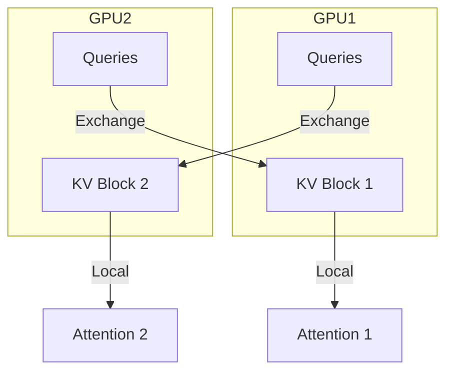

# Distributed Cross-Attention (LV-XAttn)

## 📋 Overview
LV-XAttn is designed for processing massive visual contexts by distributing KV blocks across multiple GPUs while minimizing communication overhead by only exchanging small Query blocks.

## 🏗️ Architecture Diagram

## 🔍 Key Details
- **First Used:** 2025
- **Primary Benefit:** Enables processing of high-resolution video and long sequences in MLLMs with 10x speedup.
- **Paper:** [LV-XAttn: Distributed Cross-Attention for Long Visual Inputs in Multimodal Large Language Models](https://arxiv.org/abs/2502.02406)

[⬅️ Back to README](../README.md)
