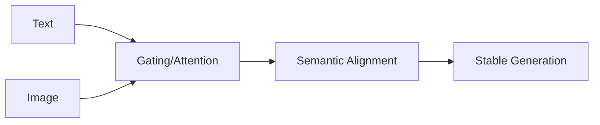

# Feature Fusion Quality

## 📋 Overview
This focus area targets the "alignment" problem—how to effectively blend disparate data types (e.g., audio and text) without losing fine-grained details or introducing noise.

## 🏗️ Logic Diagram

## 🔍 Key Details
- **Primary Techniques:** Gating functions, cross-modal residual connections, cross-attention projection.
- **Impact:** Clean, context-aware outputs in multi-modal LLMs.
- **Reference:** [Flamingo: a Visual Language Model for Few-Shot Learning](https://arxiv.org/abs/2204.14198)

[⬅️ Back to README](../README.md)
