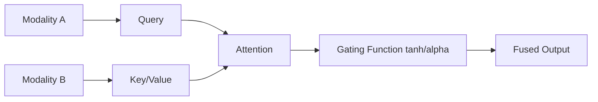

# Gated Cross-Attention (GCA)

## 📋 Overview
Gated Cross-Attention (GCA) uses learnable gating mechanisms (like Tanh) to control the flow of information between different modalities, ensuring stable training when integrating new data types.

## 🏗️ Architecture Diagram

## 🔍 Key Details
- **First Used:** 2022
- **Primary Benefit:** Dynamic control over feature fusion, essential for few-shot learning in models like Flamingo.
- **Paper:** [Flamingo: a Visual Language Model for Few-Shot Learning](https://arxiv.org/abs/2204.14198)

[⬅️ Back to README](../README.md)
