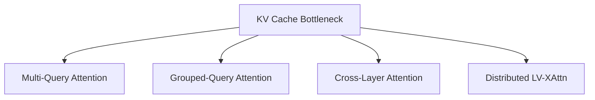

# Memory Optimization

## 📋 Overview
A core focus area in cross-attention research aimed at reducing the hardware overhead (VRAM, compute) required for processing long sequences, particularly the KV cache bottleneck.

## 🏗️ Strategy Diagram

## 🔍 Key Details
- **Primary Techniques:** KV sharing, quantization, distributed offloading.
- **Impact:** Enables 100k+ context windows on standard hardware.
- **Reference:** [Reducing Transformer Key-Value Cache Size with Cross-Layer Attention](https://arxiv.org/abs/2405.12981)

[⬅️ Back to README](../README.md)
