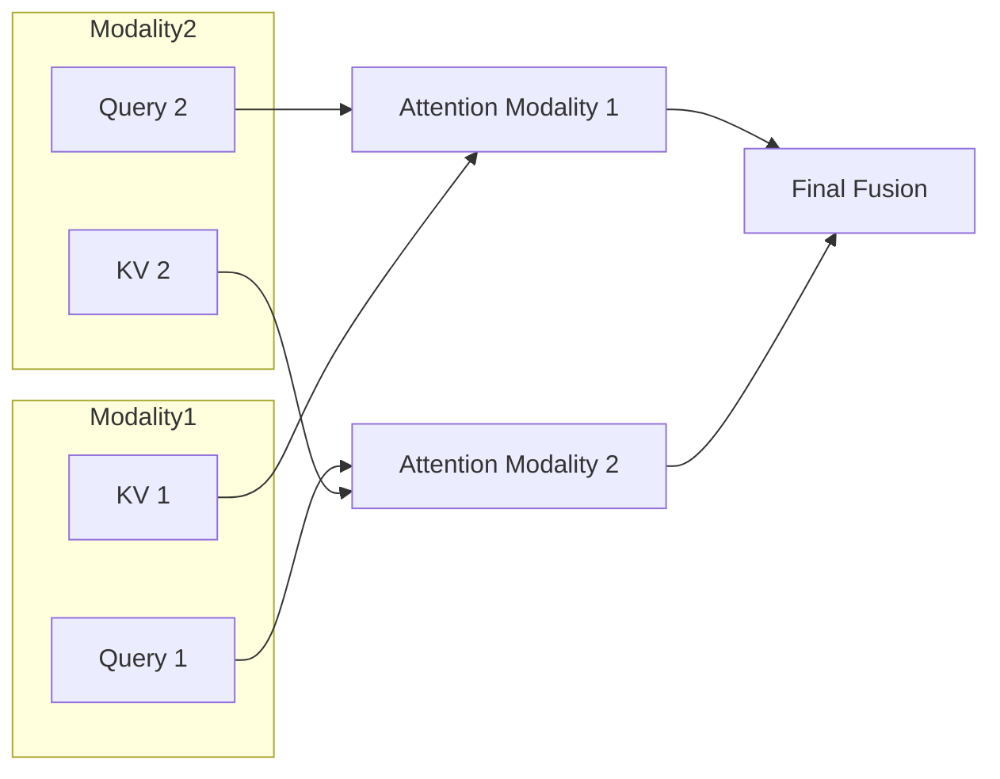

# Multi-Modal Cross-Attention (Dual-Cross-Attention)

## 📋 Overview
Dual-Cross-Attention processes reciprocal Queries from multiple modalities simultaneously, creating a bidirectional flow of information that builds deeper inter-sequence dependencies.

## 🏗️ Architecture Diagram

## 🔍 Key Details
- **First Used:** 2025
- **Primary Benefit:** Superior alignment for complex data like single-cell multi-omics or medical imaging.
- **Paper:** [scDiffusion-X](https://www.biorxiv.org/content/10.1101/2025.02.27.640020v1)

[⬅️ Back to README](../README.md)
